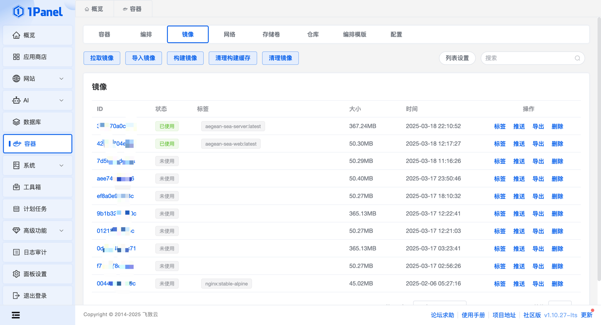
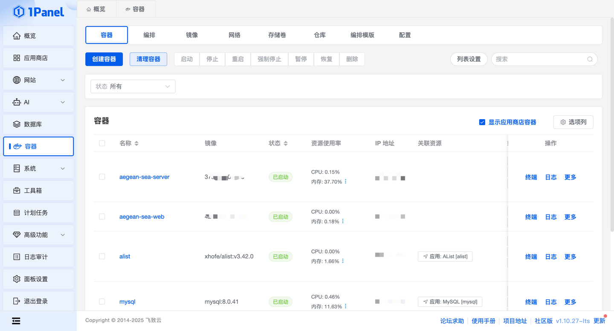
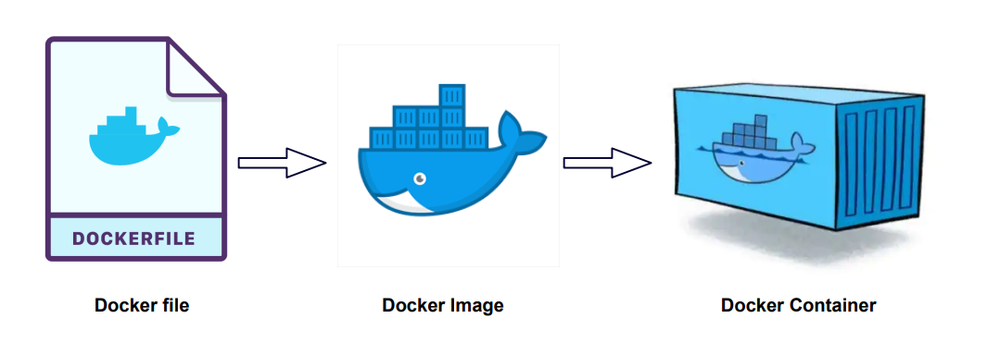
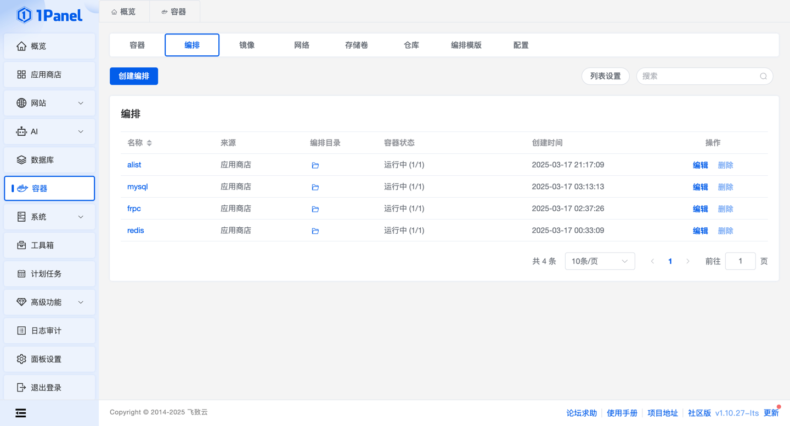

<style>
.orange {
   color: orange
}
.red {
   color: red
}
code {
   color: #0ABF5B;
}
</style>

# 一. Docker
`Docker` 是一个开源的应用容器引擎，基于 `Go` 语言 并遵从 `Apache2.0` 协议开源。通过**容器化技术**帮助开发者将应用及其依赖打包到一个轻量、可移植的容器中，从而实现快速部署、环境一致性、资源高效利用。

<!--more-->

## 1.1. 产生背景

- 传统虚拟化技术的局限性
在`docker`诞生之前，虚拟化（`VM`）是主流的环境隔离方案。但虚拟机需要模拟完整的操作系统内核，导致资源占用高（如内存、存储）、启动速度慢（分钟级），且部署负责。

- Linux容器技术的萌芽
`Linux`内核自2008年起逐步引入了`cgroups`（资源限制）和`Namespaces`（隔离机制），为轻量级容器提供了底层支持。

## 1.2. Docker的诞生
`Docker`的前身是`dotCloud`公司（成立于2010年）内部的一个项目。`dotCloud`是一家提供`PaaS`（平台即服务）的初创公司，需要一种高效的工具来管理容器化应用。
- `Solomon Hykes`主导开发了内部容器管理工具，最终命名为`Docker`。

## 1.3. Docker的核心理念
`Docker`的设计目标是通过容器化技术实现“**一次封装，到处运行**”（`write once， run anywhere`），解决以下问题：
- **环境一致性**：确保开发、测试和生产环境的一致性。
- **轻量化与快速启动**：相比虚拟机，容器无需完整操作系统，资源占用更低（秒级启动）
- **简化部署流程**：通过**镜像**（`image`）和**容器**（`container`）的分层设计，实现快速部署和版本控制。

## 1.4. 核心概念

### 1.4.1. 镜像（`image`）
镜像是一个只读的静态模板，包含运行应用所需的所有依赖和配置（如操作系统、软件、代码等）。

示例：`nginx:latest` 是一个基于`Nginx`的镜像，包含WEB服务器的完整环境。

构建方式：
- `docker commit`（从容器生产镜像）
- `Dockerfile`（通过分层指令定义镜像）


### 1.4.2. 容器（`Container`）：
从镜像创建的运行实例，是独立的、可隔离的进程空间。

特性：
- 一次性的、脆弱的（容器崩溃后数据默认不保留）。
- 支持启动、停止、删除等操作。


### 1.4.3. 仓库（`Repository`）：
- 用于存储和分发镜像的服务，分为公有仓库（如`Docker Hub`）和私有仓库。
- 示例：`library/ubuntu` 是`Docker Hub`上的官方`Ubuntu`的镜像仓库。




# 二. Docker的使用

## 2.1. Docker的安装
```bash
# 安装 Docker
sudo dnf install docker  # CentOS/RHEL
sudo apt install docker.io  # Ubuntu/Debian

# 启动 Docker 服务
sudo systemctl start docker
sudo systemctl enable docker

# 验证安装
docker run hello-world
```

## 2.2. 运行应用
使用 `docker run` 命令来在容器内运行一个应用程序。
```bash
runoob@runoob:~$ docker run ubuntu:15.10 /bin/echo "Hello world"
Hello world
```
各个参数解析：
- `docker`: `Docker` 的二进制执行文件。
- `run`: 与前面的 `docker` 组合来运行一个容器。
- `ubuntu:15.10` 指定要运行的镜像，`Docker` 首先从本地主机上查找镜像是否存在，如果不存在，`Docker` 就会从镜像仓库 `Docker Hub` 下载公共镜像。
- `/bin/echo "Hello world"`: 在启动的容器里执行的命令

以上命令完整的意思可以解释为：`Docker` 以 `ubuntu15.10` 镜像创建一个新容器，然后在容器里执行 `bin/echo "Hello world"`，然后输出结果。

## 2.3. 运行交互式的容器
我们通过 `docker` 的两个参数 `-i -t`，让 `docker` 运行的容器实现"对话"的能力：
```bash
runoob@runoob:~$ docker run -i -t ubuntu:15.10 /bin/bash
root@0123ce188bd8:/#
```
各个参数解析：
- `-t`: 在新容器内指定一个伪终端或终端。
- `-i`: 允许你对容器内的标准输入 (`STDIN`) 进行交互。

注意第二行 `root@0123ce188bd8:/#`，此时我们已进入一个 `ubuntu15.10` 系统的容器


## 2.4. 启动容器（后台模式）
使用以下命令创建一个以进程方式运行的容器
```bash
runoob@runoob:~$ docker run -d ubuntu:15.10 /bin/sh -c "while true; do echo hello world; sleep 1; done"
2b1b7a428627c51ab8810d541d759f072b4fc75487eed05812646b8534a2fe63
```
在输出中，我们没有看到期望的` "hello world"`，而是一串长字符
`2b1b7a428627c51ab8810d541d759f072b4fc75487eed05812646b8534a2fe63`
这个长字符串叫做**容器 ID**，对每个容器来说都是唯一的，我们可以通过容器 ID 来查看对应的容器发生了什么。

首先，我们需要确认容器有在运行，可以通过 `docker ps` 来查看：
```bash
runoob@runoob:~$ docker ps
CONTAINER ID        IMAGE                  COMMAND              ...  
5917eac21c36        ubuntu:15.10           "/bin/sh -c 'while t…"    ...
```
输出详情介绍：
- `CONTAINER ID`: 容器 ID。
- `IMAGE`: 使用的镜像。
- `COMMAND`: 启动容器时运行的命令。
- `CREATED`: 容器的创建时间。
- `STATUS`: 容器状态。
  - 状态有7种：
  - `created`（已创建）
  - `restarting`（重启中）
  - `running` 或 Up（运行中）
  - `removing`（迁移中）
  - `paused`（暂停）
  - `exited`（停止）
  - `dead`（死亡）
- `PORTS`: 容器的端口信息和使用的连接类型（`tcp\udp`）。
- `NAMES`: 自动分配的容器名称。

在宿主主机内使用 `docker logs` 命令，查看容器内的标准输出：
```bash
runoob@runoob:~$ docker logs 2b1b7a428627
```


# 三. Dockerfile
`Dockerfile` 是一个用来构建镜像的文本文件，文本内容包含了一条条构建镜像所需的指令和说明。

通过定义一系列命令和参数，`Dockerfile` 指导 `Docker` 构建一个自定义的镜像。

```bash
FROM openjdk:8-jdk-slim

# 设置时区环境变量
ENV TZ=Asia/Shanghai
# 安装时区数据包并创建软链接
RUN ln -fs /usr/share/zoneinfo/$TZ /etc/localtime

# 使用国内镜像源
RUN echo "deb http://mirrors.aliyun.com/debian/ buster main contrib non-free" > /etc/apt/sources.list && \
    echo "deb http://mirrors.aliyun.com/debian-security/ buster/updates main contrib non-free" >> /etc/apt/sources.list && \
    echo "deb http://mirrors.aliyun.com/debian/ buster-updates main contrib non-free" >> /etc/apt/sources.list

# 安装字体库，解决验证码无法显示问题
RUN apt-get update && \
    apt-get install -y fontconfig libfreetype6 tzdata && \
    rm -rf /var/lib/apt/lists/*

# 程序工作目录，不可随意更换，PathUtils.java文件中有使用这个目录来加载图片数据
WORKDIR /app

ADD target/admin.jar /app/admin.jar
ADD arthas-boot.jar /arthas-boot.jar

# 修正后的 JAVA_OPTS
ENV JAVA_OPTS="-Xms512m -Xmx512m -XX:+UseG1GC -XX:MaxGCPauseMillis=200 -XX:+HeapDumpOnOutOfMemoryError -XX:HeapDumpPath=/app/dump/admin.hprof -agentlib:jdwp=transport=dt_socket,server=y,suspend=n,address=5005 -Duser.timezone=Asia/Shanghai"

EXPOSE 8080 6005 9563

# 使用 Shell 格式的 ENTRYPOINT 以解析环境变量
ENTRYPOINT java $JAVA_OPTS -jar admin.jar --spring.profiles.active=${PROFILE_ACTIVE}
```

| Dockerfile 指令	 | 说明                                          |
|----------------|---------------------------------------------|
| `FROM`	        | 指定基础镜像，用于后续的指令构建。                           |
| `MAINTAINER`	  | 指定Dockerfile的作者/维护者。（已弃用，推荐使用LABEL指令）       |
| `LABEL`	       | 添加镜像的元数据，使用键值对的形式。                          |
| `RUN`	         | 在构建过程中在镜像中执行命令。                             |
| `CMD`	         | 指定容器创建时的默认命令。（可以被覆盖）                        |
| `ENTRYPOINT`   | 	设置容器创建时的主要命令。（不可被覆盖）                       |
| `EXPOSE`	      | 声明容器运行时监听的特定网络端口。                           |
| `ENV`	         | 在容器内部设置环境变量。                                |
| `ADD`	         | 将文件、目录或远程URL复制到镜像中。                         |
| `COPY`	          | 将文件或目录复制到镜像中。                               |
| `VOLUME`         | 	为容器创建挂载点或声明卷。                              |
| `WORKDIR`        | 	设置后续指令的工作目录。                               |
| `USER`	          | 指定后续指令的用户上下文。                               |
| `ARG`            | 	定义在构建过程中传递给构建器的变量，可使用 "docker build" 命令设置。 |
| `ONBUILD`        | 	当该镜像被用作另一个构建过程的基础时，添加触发器。                  |
| `STOPSIGNAL`     | 	设置发送给容器以退出的系统调用信号。                         |
| `HEALTHCHECK`    | 	定义周期性检查容器健康状态的命令。                          |
| `SHELL`          | 	覆盖Docker中默认的shell，用于RUN、CMD和ENTRYPOINT指令。  |


# 四. Docker编排


## 4.1. 什么是编排？
比喻：Docker编排就像“交响乐团的指挥”
- 问题：想举办一场音乐会，但需要协调多个乐器（小提琴、钢琴、鼓等）和乐手，确保它们同时演奏、互相配合，并且如果某个乐器坏了，能快速替换。
- Docker编排的作用，就是是指挥家，负责：
  - 安排所有容器的顺序和位置（比如先启动数据库，再启动应用服务）。
  - 确保容器之间能“沟通”（比如应用服务器需要连接数据库）。
  - 监控容器状态（如果某个容器崩溃，自动重启或替换）。
  - 动态调整资源（比如音乐会人数多时，增加鼓手；人数少是减少鼓手）。

## 4.2. 为什么需要编排？
1. 手动管理容器太麻烦
   - 假设你的应用由10个微服务组成（比如用户服务、订单服务、支付服务等），每个服务需要独立的容器。手动启动、配置网络、管理依赖关系会非常繁琐。
   - Docker编排的作用：用一个配置文件（如docker-compose.yml）定义所有服务，一键启动整个系统。
2. 容器需要协作
   - 比如数据库容器必须先启动，应用服务才能连接它。如果数据库容器崩溃，应用服务可能无法正常运行。
   - Docker编排的作用：自动处理依赖关系，监控健康状态，自动重启失败的容器。
3. 动态扩展需求
   - 假设电商网站在“双11”期间流量激增，需要快速增加服务器数量。
   - Docker编排的作用：自动扩缩容，动态分配资源。

## 4.3. 编排的工具

### 4.3.1. `Docker Compose`
- **适用场景**：小型项目（单台服务器）
- **特点**：
  - 用`docker-compose.yml`文件定义服务、网络、依赖关系。
  - 一键启动所有容器
  - 适合开发和测试环境。

```yaml
version: '3'
services:
  web:
    image: nginx:latest
    ports:
      - "80:80"
  db:
    image: mysql:5.7
    environment:
      MYSQL_ROOT_PASSWORD: root
```
运行命令：`docker-compose up`，`Docker`会自动启动`web`和`db`容器，并确保`web`先连接`db`。

### 4.3.2. Kubernetes（k8s）
- **适合场景**：大规模生产环境（多台服务器集群）
- **特点**：
  - 自动扩缩容、负载均衡、滚动更新。
  - 支持复杂的网络策略和存储管理。
  - 需要较高的学习成本。


# 五. Docker的核心原理
`Docker` 的原理基于 `Linux` 内核的**命名空间**（`Namespace`）和 **控制组**（`Cgroups`），通过这些技术实现容器的资源隔离和资源限制。

## 5.1. 核心技术

### 5.1.1. 命名空间（Namespace）
**命名空间**是`Linux`内核提供的一种**隔离机制**，`Docker` 利用它为每个容器创建独立的运行环境。每个容器拥有自己的：
- **PID命名空间**：隔离进程ID，容器内的进程对宿主机和其他容器不可见。
- **Network命名空间**：隔离网络接口、IP地址、路由表等，容器可以拥有独立的网络栈。
- **Mount命名空间**：隔离文件系统挂载点，容器可以有自己的文件系统视图。
- **UTS命名空间**：隔离主机名和域名，容器可以自定义主机名。
- **User命名空间**：隔离用户和用户组，容器内用户ID可与宿主机不同。
- **IPC命名空间**：隔离进程间通信（IPC）资源（如消息队列、信号量）。

**作用**：通过命名空间，容器看起来像是一个独立的操作系统实例，但实际上共享宿主机的内核。

#### 5.1.1.1. Namespace的使用
涉及到`Namespace`的操作接口包括`clone()、setns()、unshare()`以及还有`/proc`下的部分文件。为了使用特定的`Namespace`，在使用这些接口的时候需要指定以下一个或多个参数：
- `CLONE_NEWNS`: 用于指定`Mount Namespace`
- `CLONE_NEWUTS`: 用于指定`UTS Namespace`
- `CLONE_NEWIPC`: 用于指定`IPC Namespace`
- `CLONE_NEWPID`: 用于指定`PID Namespace`
- `CLONE_NEWNET`: 用于指定`Network Namespace`
- `CLONE_NEWUSER`: 用于指定`User Namespace`
下面简单概述一下这几个接口的用法。

1. clone系统调用
可以通过clone系统调用来创建一个独立Namespace的进程，它的函数描述如下：
```c
int clone(int (*child_func)(void *), void *child_stack, int flags, void *arg);
```


### 5.1.2. 控制组（Cgroups）
`Cgroups` 是 `Linux` 内核的资源管理机制，`Docker`用它限制容器的资源使用（如CPU、内存、磁盘I/O等）。
- **CPU配额**：限制容器最多使用多少CPU时间。
- **内存限制**：防止容器占用过多内存导致系统崩溃。
- **磁盘I/O限制**：控制容器的读写速度和带宽。

**作用**：确保容器之间资源分配合理，避免资源争抢。


参考文章：
[Linux namespace](https://www.cnblogs.com/sparkdev/p/9365405.html)
