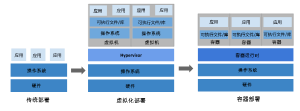
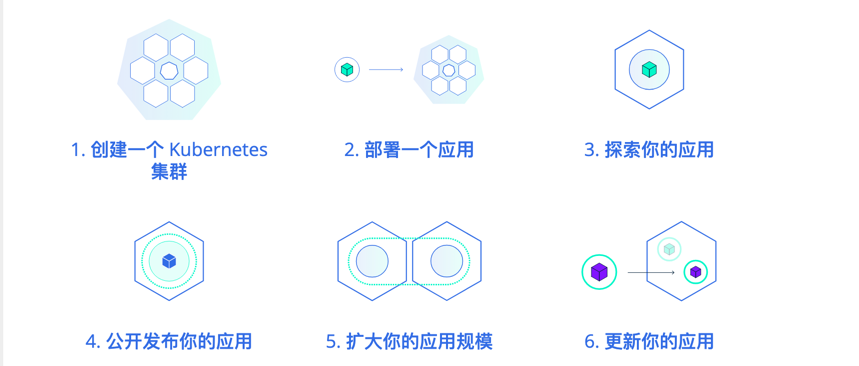
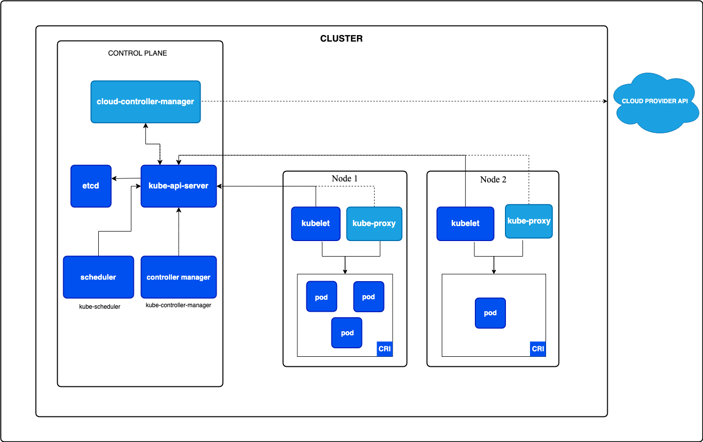
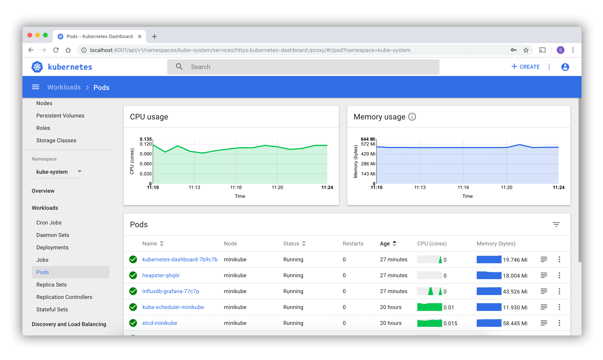

<style>
.orange {
   color: orange
}
.red {
   color: red
}
code {
   color: #0ABF5B;
}
</style>

# 一. kubernetes
`kubernetes` (简称K8s)，是一个开源的**容器编排平台**，主要用于自动化部署、扩展和管理容器化应用。它由`Google`开发并捐赠给`Cloud Native Computing Foundation(CNCF)`，是云原生技术的核心工具之一。
> `Kubernetes` 这个名字源于希腊语，意为“舵手”或“飞行员”。`K8s` 这个缩写是因为 `K` 和 `s` 之间有 `8` 个字符的关系。

<!--more-->

## 1.1. 产生背景

1. `Docker`的出现，彻底改变了应用的打包盒部署方式。容器技术解决了“环境一致性”问题（即“在我机器上能跑”），使得应用可以以轻量级、标准化的方式运行。
- **问题**：随着容器数量的增加（尤其是微服务架构下成百上千个容器），如何高效管理这些容器成为新的挑战。
  - 手动部署、扩缩容、监控、故障恢复等工作变得复杂且容易出错。
  - 容器之间的网络通信、存储共享、资源分配等问题需要自动化解决方案。
2. 微服务架构的兴起
- 传统单体应用逐渐被拆分为多个独立的微服务（如订单、支付、用户）。每个微服务需要独立部署、扩展和维护，导致：
  - `部署复杂性`：需要协调多个服务的依赖关系和启动顺序。
  - `资源管理`：如何高效利用服务器资源，避免资源浪费或争抢。
  - `高可用性`：如何确保服务在故障时自动恢复，避免单点故障。
  - `跨环境一致性`：开发、测试、生产环境的配置差异可能导致部署问题。


## 1.2. 基础知识模块



# 二. Kubernetes 架构
`Kubernetes` 集群的组成：
- 1个控制平面：包含`API server、etcd、Controller Manager、Scheduler`等组件
- 一组用于运行容器化应用的工作机器组成：
  - `worker`节点：运行容器，包含`kubelet、kube-proxy`和容器运行时（如Docker）。
  - 工作节点托管着组成应用负载的 `Pod`。控制平面管理集群中的工作节点和 `Pod`。


## 2.1. 控制平面组件
| 组件名                     | 描述                                                                                                                        |
|-------------------------|---------------------------------------------------------------------------------------------------------------------------|
| kube-apiserver          | 该组件负责公开了 `Kubernetes API`，负责处理接受请求的工作。 `API` 服务器是 `Kubernetes` 控制平面的前端。                                                         |
| etcd                    | 一致且高可用的键值存储，用作 `Kubernetes` 所有集群数据的后台数据库。                                                                                   |
| kube-scheduler          | 负责监视新创建的、未指定运行节点（`node`）的 `Pods`， 并选择节点来让 `Pod` 在上面运行。调度决策考虑的因素包括单个 `Pod` 及 `Pods` 集合的资源需求、软硬件及策略约束、 亲和性及反亲和性规范、数据位置、工作负载间的干扰及最后时限。 |
| kube-controller-manager | 从逻辑上讲， 每个控制器都是一个单独的进程， 但是为了降低复杂性，它们都被编译到同一个可执行文件，并在同一个进程中运行。                                                              |


## 2.2. 节点组件

| 组件名            | 描述                                                               |
|----------------|------------------------------------------------------------------|
| kubelet        | `kubelet` 会在集群中每个节点（`node`）上运行。 它保证容器（`containers`）都运行在 `Pod` 中。 |
| pod            | 最小部署单元，是一个容器组（就像豌豆荚），包含一个或多个共享资源的容器（例如Docker中的容器，即运行实例）       |
| kube-proxy（可选） | 每个节点（`node`）上所运行的网络代理， 实现 `Kubernetes` 服务（`Service`） 概念的一部分。     |
| service        | 提供稳定的IP和DNS，实现`Pod`的访问                                           |

# 三、Pod
`Pod` （就像豌豆荚），其共享上下文包括一组 `Linux` 命名空间、控制组（`CGroup`）和可能一些其他的隔离方面， 即用来隔离容器的技术。 在 Pod 的上下文中，每个独立的应用可能会进一步实施隔离。

Pod 类似于共享命名空间并共享文件系统卷的一组容器。

## 3.1. pod使用
下面是一个 `Pod` 示例，它由一个运行镜像 `nginx:1.14.2` 的容器组成。
```yaml
apiVersion: v1
kind: Pod
metadata:
  name: nginx
spec:
  containers:
  - name: nginx
    image: nginx:1.14.2
    ports:
    - containerPort: 80
```
要创建上面显示的 Pod，请运行以下命令：
```bash
kubectl apply -f https://k8s.io/examples/pods/simple-pod.yaml
```
`Pod` 通常不是直接创建的，而是使用工作负载资源创建的。
> 你很少在 `Kubernetes` 中直接创建一个个的 `Pod`，甚至是单实例（Singleton）的 Pod。 这是因为 `Pod` 被设计成了相对临时性的、用后即抛的一次性实体。 当 Pod 由你或者间接地由控制器 创建时，它被调度在集群中的节点上运行。 `Pod` 会保持在该节点上运行，直到 `Pod` 结束执行、`Pod` 对象被删除、`Pod` 因资源不足而被驱逐或者节点失效为止。


# 四. 服务、负载均衡和联网

## 4.1. 服务（service）
`Kubernetes` 中 `Service` 是 将运行在一个或一组 `Pod` 上的网络应用程序公开为网络服务的方法。
> 将在集群中**运行的应用**通过同一个面向外界的端点公开出去，即使工作负载分散于多个后端也完全可行。

`Kubernetes` 中 `Service` 的一个**关键目标**是让你无需修改现有应用以使用某种不熟悉的服务发现机制。 你可以在 `Pod` 集合中运行代码，无论该代码是为云原生环境设计的，还是被容器化的老应用。 你可以使用 `Service` 让一组 `Pod` 可在网络上访问，这样客户端就能与之交互。

### 4.1.1. 定义 Service 
`Kubernetes` 中的 `Service` 是一个对象 （与 `Pod` 或 `ConfigMap` 类似）。你可以使用 `Kubernetes API` 创建、查看或修改 `Service` 定义。 通常你会使用 `kubectl` 这类工具来替你发起这些 `API` 调用。

例如，假定有一组 `Pod`，每个 `Pod` 都在侦听 `TCP` 端口 `9376`，并且它们还被打上 `app.kubernetes.io/name=MyApp` 标签。你可以定义一个 `Service` 来发布该 `TCP` 侦听器。
```yaml
apiVersion: v1
kind: Service
metadata:
  name: my-service
spec:
  selector:
    app.kubernetes.io/name: MyApp
  ports:
    - protocol: TCP
      port: 80
      targetPort: 9376
```
应用上述清单时，系统将创建一个名为 "`my-service`" 的、 服务类型默认为 `ClusterIP` 的 `Service`。 该 `Service` 指向带有标签 `app.kubernetes.io/name: MyApp` 的所有 `Pod` 的 `TCP` 端口 `9376`。


# 五. Kubernetes 为你提供：

- **服务发现和负载均衡**
`Kubernetes` 可以使用 DNS 名称或自己的 IP 地址来暴露容器。 如果进入容器的流量很大， `Kubernetes` 可以负载均衡并分配网络流量，从而使部署稳定。
- **存储编排**
`Kubernetes` 允许你自动挂载你选择的存储系统，例如本地存储、公共云提供商等。
- **自动部署和回滚**
你可以使用 `Kubernetes` 描述已部署容器的所需状态， 它可以以受控的速率将实际状态更改为期望状态。 例如，你可以自动化 `Kubernetes` 来为你的部署创建新容器， 删除现有容器并将它们的所有资源用于新容器。
- **自动完成装箱计算**
你为 `Kubernetes` 提供许多节点组成的集群，在这个集群上运行容器化的任务。 你告诉 `Kubernetes` 每个容器需要多少 `CPU` 和内存 (`RAM`)。 `Kubernetes` 可以将这些容器按实际情况调度到你的节点上，以最佳方式利用你的资源。
- **自我修复**
`Kubernetes` 将重新启动失败的容器、替换容器、杀死不响应用户定义的运行状况检查的容器， 并且在准备好服务之前不将其通告给客户端。
- **密钥与配置管理**
`Kubernetes` 允许你存储和管理敏感信息，例如密码、`OAuth` 令牌和 `SSH` 密钥。 你可以在不重建容器镜像的情况下部署和更新密钥和应用程序配置，也无需在堆栈配置中暴露密钥。
- **批处理执行** 除了服务外，`Kubernetes` 还可以管理你的批处理和 `CI`（持续集成）工作负载，如有需要，可以替换失败的容器。
- **水平扩缩** 使用简单的命令、用户界面或根据 CPU 使用率自动对你的应用进行扩缩。
- **IPv4/IPv6 双栈** 为 `Pod`（容器组）和 `Service`（服务）分配 `IPv4` 和 `IPv6` 地址。
- **为可扩展性设计** 在不改变上游源代码的情况下为你的 `Kubernetes` 集群添加功能。

# 六. 后台管理平台



参考文章：
[k8s概述](https://kubernetes.io/zh-cn/docs/concepts/overview/)