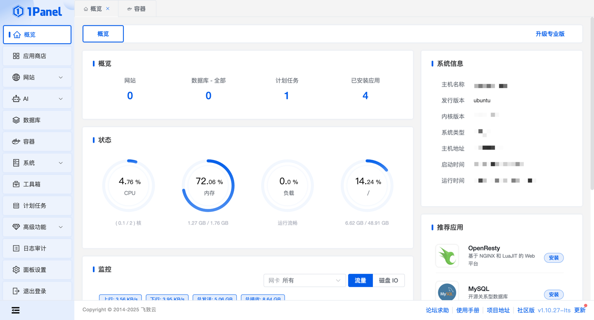

<style>
.orange {
   color: orange
}
.red {
   color: red
}
code {
   color: #0ABF5B;
}
</style>

# 一. 1panel
`1panel`是一款现代化、开源的Linux服务器运维管理面板，旨在通过web界面简化服务器管理、应用部署和容器化操作。

<!--more-->



## 1.1. 核心功能
- **快速建站**
  - 深度集成`wordpress`和`halo`，一键完成域名绑定、SSL证书配置等操作。
  - 支持一键部署`LNMP（Linux + Nginx + Mysql + PHP）`环境，适合个人博客、企业官网等场景。
- **服务器管理**
  - 提供主机监控（CPU、内存、磁盘）、文件管理、数据库管理、容器管理等功能。
  - 通过图形化界面操作，无需复杂命令行操作。
- **一键备份与恢复**
  - 支持将数据备份到本地磁盘或云端存储（如阿里云OOS）
  - 提供一键恢复功能，防止数据丢失。
- **应用商店**
  - 提供丰富的开源工具和应用，支持一键安装和升级。


# 二. 安装与部署
1. **在线安装**
通过脚本一键安装
```bash
curl -sSL https://resource.fit2cloud.com/1panel/package/quick_start.sh -o quick_start.sh && sh quick_start.sh
```
- **配置镜像加速**：避免Docker镜像拉取失败。
- **开放防火墙端口**：需在云服务器安全组中开放1panel默认端口（如20410或自定义端口）


# 三. 计划任务
主要用于管理需要定时执行的任务，如定期执行某shell脚本、定期备份、定期访问url等，同时支持手动执行。

## 3.1. 备份文件
例如将数据备份的阿里云盘。
```bash
rclone copy /opt/aegean-sea/images aliyun:/aegean-sea/images
```


> 参考文章
> 
> [1Panel 文档](https://1panel.cn/docs/)
