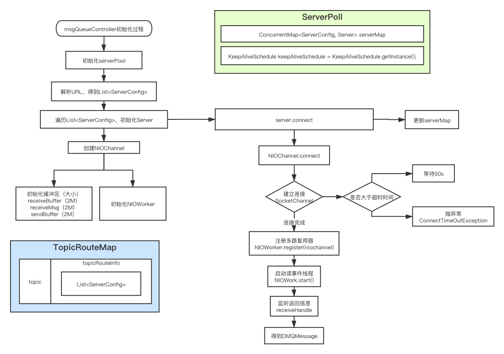
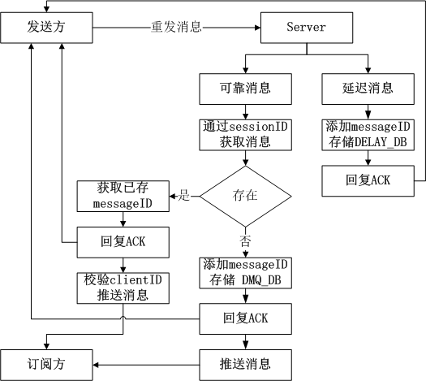
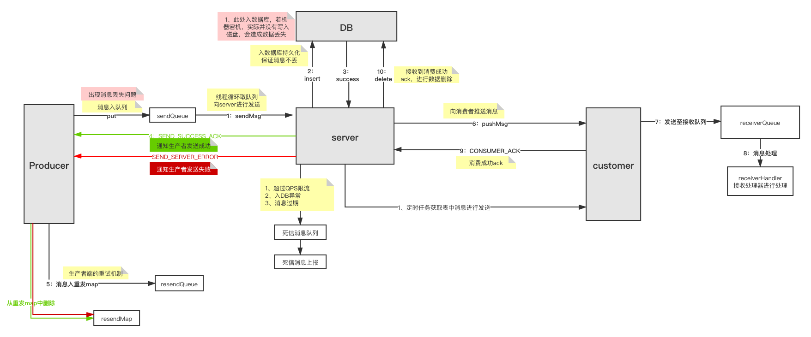

# 一、注册中心
注册中心，基于zookeeper来实现。
- /dmq/topic下为主题号，主题号下为客户端。
- /dmq/node下为server节点。

<!--more-->  


``` bash
1、server心跳节点上报到注册中心，节点变化，由注册中心通知client，client每一小时拉取一次全量的配置信息
2、client和一台注册中心保持长连接，定时查询server信息，如果该register server挂掉，消费者会自动连接下一个registerserver，直到有可用连接为止，并能自动重连；
3、心跳保持30s的好处是，可以及时的检测server状态；
```
# 二、生产者
### 2.0 初始化启动过程


>- 1、初始化serverPoll
>- 2、解析URL服务器地址，生成相应serverConfig，并初始化连接。

### 2.1 生产过程：

- 1、mqClient.send(msg)，客户端API发送消息。
- 2、内部消息队列控制器（MsgQueueController）将消息存入发送消息队列（sendQueue）
    - 2.1、sessionid<0或者消息体超过64kb直接放入通知队列
    - 2.2、队列超长之后进行回调处理

### 2.2 消息处理过程：
***2.2.1 发送消息队列***
- 1、sendRunner循环从sendQueue取数据。
- 2、主题路由获取server，向server发送数据。
    - 2.1、若发送出现异常，则将消息入接收消息队列（notifyQueue）。
- 3、判断消息类型（非ack && 非resend）
    - 3.1、将消息放入消息重发map（resendMap;<Long, value>=<sessionId, WinData）。

```
while (mqController.isOpen()) {
    MqBody mqBody = null;
    try {
        WinData winData = mqController.getSendMsg();
  		if (winData != null && winData.getMqBody() != null) {
  		    mqBody = winData.getMqBody();
  		    try {
  			    if (mqBody.getCommandType() == UP_SUBSCRIBE) {
  				    winData.getNioChannel().getServer().send(mqBody);
  			    } else {
  				    topicRoute.send(false, winData, mqController);
  			    }
  			} catch (Exception e) {
  			    winData.setStatus(SOCKET_ERROR);
  			    mqController.offerNotifyMsg(winData);
  			    continue;
  			}
  			if (mqBody.getCommandType() != UP_CONSUMER_ACK && mqBody.getCommandType() != UP_PRODUCER_RESEND) {
  			    mqController.offerResendMsg(winData);
  			}
  		}
  	} catch (Exception e) {
  	}
}
```


***2.2.2 消息重发map***
- 1、resendRunner循环从resendMap取数据。
- 2、判断消息的重发次数小于3
    - 2.1、若消息发送时间已经超过30s，则将消息发送至sendQueue
- 3、发送次数>3
    - 3.1、将消息从resendMap中删除。
    - 3.2、将消息发送至notifyQueue中。
    
```
while (mqController.isOpen()) {
    try {
        for (Map.Entry<Long, WinData> entry : mqController.getResendMap().entrySet()) {
            WinData winData = entry.getValue();
            if (winData == null || winData.getMqBody() == null) {
                continue;
            }
            //MqBody clone = winData.getMqBody().clone();
            //防止订阅者重发时在获得channel时出现空指针，将windowdata直接clone放入重发队列
            WinData clone = winData.clone();
            long last = System.currentTimeMillis() - clone.getMqBody().getTimestamp();
            if(winData.getCount() > 0){
            	if(last > MQConst.OUT_TIME * (RESEND_TIME - winData.getCount() + 1)){
                    if(clone.getMqBody().getCommandType().getCode()!=UP_SUBSCRIBE.getCode()){
                        clone.getMqBody().setCommandType(UP_PRODUCER_RESEND);
                    }
                    winData.setCount(winData.getCount() - 1);
                    //mqController.offerSendMsg(clone, winData.getCount() - 1, winData.getISendCallback());
                    //将clone出来的windowdata放入发送队列
                    mqController.offerSendWin(clone);
            	}
            }else{
            	WinData remove = mqController.removeResendMsg(clone.getMqBody().getSessionId());
                remove.setStatus(SendMsgStatusEnum.OUT_OF_RETRY);
                mqController.offerNotifyMsg(remove);
            }
        }
        Thread.sleep(1000);
    } catch (Exception e) {
    }
}
```
    
消息最多重发3次，每隔30s进行重发，超过以后不进行重发。  

***2.2.3 接收消息队列***
- 1、notifyMsgRunner循环从notifyQueue取数据。
- 2、判断消息类型
    - 2.1、消费者类型消息，调用相应handler进行相应处理。
    - 2.2、ack类型消息，调用callback进行相应处理。


### 2.3 接收server的ack
- 1、通过NIOChannel进行通信，将结果回传。
- 2、根据ack类型，进行相应处理
    - 2.1、下发成功、主题号异常、服务异常：此时会将消息从重发Map中去除、并将消息放入notifyQueue中。
    - 2.2、机器重启：将该主题号下的重启服务去除。
    - 2.3、生产者消息：调用消费者的ReceiveHandler业务处理逻辑，进行相应处理。
    
```
switch (mqBody.getCommandType()) {
    case SUBSCRIBE_ACK:
    case SEND_SUCCESS_ACK:
    case SEND_NO_TOPIC_ACK:
    case SUBSCRIBE_NO_TOPIC_ACK:
    case SUBSCRIBE_NO_CLIENT_ID_ACK:
    case SEND_SERVER_ERROR:
    case SUBSCRIBE_SERVER_ERROR:
    case SEND_EXCEED_LIMIT_ACK:
        winData = mqController.removeResendMsg(mqBody.getSessionId());
        if (winData == null || winData.getMqBody() == null) {
            LOGGER.debug("get window data null from {}", mqBody);
            break;
        }
        winData.setStatus(SendMsgStatusEnum.getByCommand(mqBody.getCommandType()));
        //将服务端返回的消息赋值给重发队列中的消息
        MqBody mqBodyInClient = winData.getMqBody();
        mqBodyInClient.setMessageId(mqBody.getMessageId());
        mqBodyInClient.setCommandType(mqBody.getCommandType());
        winData.setDmqBody(mqBodyInClient);
        mqController.offerNotifyMsg(winData);
        break;
    case CONSUMER_PUSH:
        winData = new WinData(mqBody, -1, null);
        boolean isDistinct = mqController.offerDistinctMsg(mqBody.getSessionId(),mqBody.getClientID());
        if (isDistinct) {
            winData.setNioChannel(this);
            //将推送来的消息放入消息接收队列
            mqController.offerReceiveMsg(winData);
        } else {
            LOGGER.debug("repeat msg {}", mqBody);
        }
        break;
    case SERVER_REBOOT:
        LOGGER.debug("server is rebooting");
        mqController.removeSubServer(server);
        server.setState(RESTART);
        break;
    case SERVER_HEALTH:
        LOGGER.debug("server is health");
        server.setState(HEALTH);
        server.setErrorTime(Long.MAX_VALUE);
        break;
    case SERVER__HEARTBEAT:
        LOGGER.debug("receive server heartbeat ");
        break;
    default:
        throw new SerializeException("un know commandType " + mqBody.getCommandType());
}
``` 
    
### 2.4 生产者问题
``` bash
1、消息存入队列中，若队列数据量大，此时机器挂机，会出现消息丢失，数据丢失时，依赖业务方日志由业务方自己重发消息，未提供持久化支持。可以采用QMQ方式，支持消息的持久化。    
```
# 三、MQ server

### 3.1 启动过程


    a、zk注册，拉取主题号、client等信息，并启动定时任务去更新每3s一次。
    b、初始化DB。
    c、启动定时任务去发送离线消息。
    d、启动TcpServer，监听请求，并对请求进行相应的分发处理。
    e、启动telnetServer。

### 3.2 订阅者注册
- tcpServer接收到订阅者注册消息，将消息分发给SubscribeHandler。然后通过线程池创建相应的线程去处理，将当前消费者的client设置到该主题号下。


以下为代码：

    subExecutor.submit(new Runnable() {
        public void run() {
            try {
                MqBody mqBody = mqContext.getMqBody();
                // validate topic
                List<Client> clientList = clientService.getClientList(mqBody.getTopic());
                if (CollectionUtils.isEmpty(clientList)) {
                    // ack consumer no topic
                    clientService.ackClient(mqBody, mqContext.getChannel(), SUBSCRIBE_NO_TOPIC_ACK, "");
                    return;
                }
                // add new channel for consumer
                if (addChannel(clientList, mqBody.getClientID(), mqContext.getChannel())) {
                    // ack consumer
                    clientService.ackClient(mqBody, mqContext.getChannel(), SUBSCRIBE_ACK, "");
                } else {
                    // ack consumer no client id
                    clientService.ackClient(mqBody, mqContext.getChannel(), SUBSCRIBE_NO_CLIENT_ID_ACK, "");
                    return;
                }
                offlineExecutor.schedule(getInstance(mqBody), OFFLINE_DELAY_TIME, TimeUnit.MILLISECONDS);
            } catch (Exception e) {
                clientService.ackClient(mqContext.getMqBody(), mqContext.getChannel(), SUBSCRIBE_SERVER_ERROR, Throwables.getStackTraceAsString(e));
            }
        }
    });   

### 3.3 接收消息
- tcpServer接收到生产者发送消息，将消息分发给SendMsgHandler。然后通过线程池创建相应的线程去处理消息的存储、ack及推送。


    可靠消息：
        1、先进行存储至DB
        2、入DB成功后，恢复Client进行消息通知。
        3、再进行数据的推送。
    延迟消息：
        1、先进行存储至延迟DB
        2、入DB成功后，恢复Client进行消息通知。

以下为代码：

    public void run() {
        try {
            MqBody mqBody = mqContext.getMqBody();
            mqBody.setMessageId(IdUtil.generateId());
            // validate topic
            List<Client> clientList = clientService.getClientList(mqBody.getTopic());
            if (CollectionUtils.isEmpty(clientList)) {
                clientService.ackClient(mqBody, mqContext.getChannel(), SEND_NO_TOPIC_ACK, "");
                return;
            }
            if (mqBody.getMsgTypeEnum() == MsgTypeEnum.RELIABLE) {
                // 可靠消息存储
                if (messageService.saveMessage(mqBody, clientList)) {
                    // 成功ack给生产者
                    clientService.ackClient(mqBody, mqContext.getChannel(), SEND_SUCCESS_ACK, "");
                    // 推送给消费者
                    clientService.pushMsg(mqBody, clientList, false);
                } else {
                    // 存储失败，通知生产者异常ack
                    clientService.ackClient(mqBody, mqContext.getChannel(), SEND_SERVER_ERROR, Util.getMqConfig().serverErrorDes());
                }
            } else if (mqBody.getMsgTypeEnum() == MsgTypeEnum.DELAY) {
                if(delayMsgService.insert(mqBody)){//延迟消息入库
                    //成功ack
                    clientService.ackClient(mqBody, mqContext.getChannel(), SEND_SUCCESS_ACK, "");
                }else{
                    //失败ack
                    clientService.ackClient(mqBody, mqContext.getChannel(), SEND_SERVER_ERROR, Util.getMqConfig().serverErrorDes());
                }
            }
        } catch (Exception e) {
            //异常ack
            clientService.ackClient(mqContext.getMqBody(), mqContext.getChannel(), SEND_SERVER_ERROR, Throwables.getStackTraceAsString(e));
        } finally {
        }
    }

### 3.4 接收重复消息


### 3.5 死信消息
消息入死信队列情况：

    1、超过QPS限流。
    2、入DB异常。
    3、消息过期。
    
死信消息上报时，单独持久化至DB。由MQ管理平台控制，死信消息由人工处理，可以进行重发或者删除。

# 四、消费者
    1、查看文章图二，ReceiveQueue存放的是生产者发送的消息，该队列的消费线程poll队列消息，调用相应的ReceiveHandler进行相应的业务逻辑处理。
    2、此时消费者可以设置是否自动ack，回复ack，此时会将库中的持久化数据进行删除；若不ack，则会一直发送。

# 五、总结


1、问题一：Producer会将消息存放在本地的queue中，若producer宕机，会出现消息丢失问题。
    
    解决方法一：实时发送至server。
    解决方法二：producer提供持久化方式，如入库、写文件。
    
2、问题二：server写DB时只写入os cache，此时DB挂机可能出现server消息丢失。

    解决方法一：写DB强制写入磁盘，效率较低。
    解决方案二：customer返回ack时才通知producer发送成功ack。